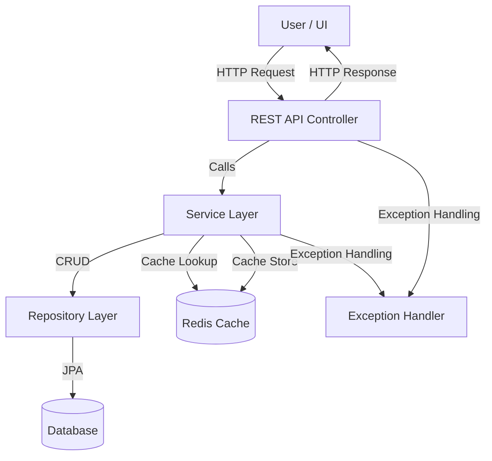

# URL Shortener Architecture

  
Technical Architecture Overview

    

**Description:**
- **User/UI**: Can be Streamlit, Gradio, Postman, or any HTTP client.
- **Spring Boot REST API**: Handles incoming HTTP requests and responses.
- **Service Layer**: Contains business logic for shortening and retrieving URLs, handling custom aliases, expiry, and click counts.
- **Repository Layer**: Uses Spring Data JPA to interact with the database.
- **Database**: Stores URL mappings (H2 for dev/testing, MySQL for production).
- **Cache (Optional)**: Redis can be added for faster lookups.
- **Global Exception Handler**: Handles and formats errors for the